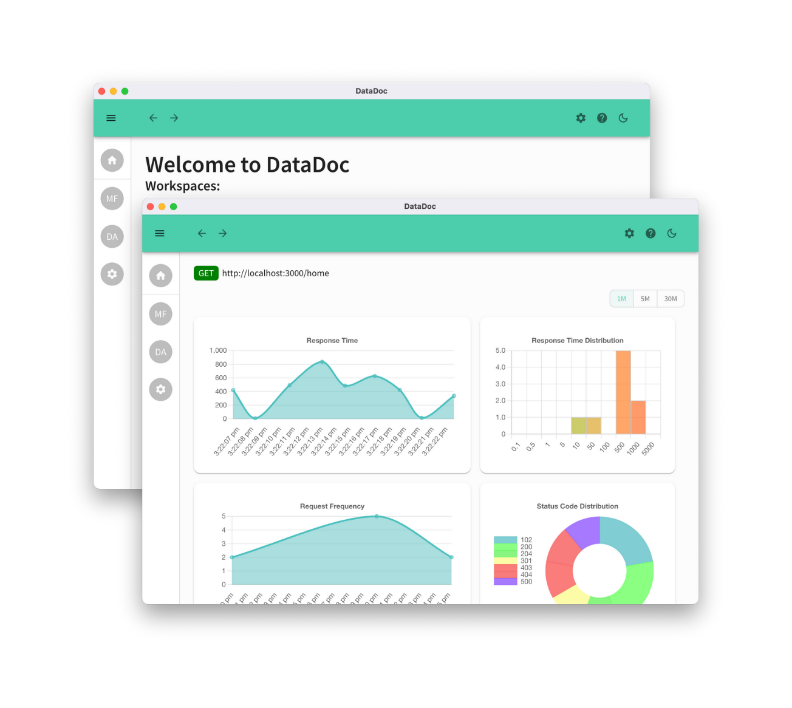
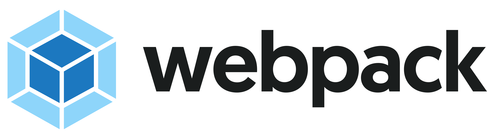

# DataDoc

DataDoc is an endpoint monitoring, detection and traffic simulation tool that provides real-time metrics and customizable alert notifications.



### Table of Contents
   * [Getting Started](#getting-started)
        * [Prerequisites](#prerequisites)
        * [Installation](#installation)
   * [How To Use](#how-to-use)
        * [Adding Workspaces](#adding-workspaces)
        * [Using the Monitoring Tool](#using-the-monitoring-tool)
        * [Using the Simulation Tool](#using-the-simulation-tool)
        * [Configuring Alerts](#configuring-alerts)
   * [Tech Stack](#tech-stack)
   * [Authors](#authors)

## Getting Started <a name="getting-started"></a>

### Prerequisites <a name="prerequisites"></a>

- Node.js v18^
- Docker

### Installation <a name="installation"></a>

This tool requires the npm package `express-endpoints-monitor` to detect and gather metrics for endpoints in your Express application. To understand how to use this plugin, see the <a href="https://www.npmjs.com/package/express-endpoints-monitor">full documentation</a>.

1. Run the following terminal command in your project directory that you would like to begin monitoring:

    ```
    npm install express-endpoints-monitor
    ```

    This should have created a `express-endpoints-monitor/` folder in your `node_modules/` directory

2. WIP: <a href="https://github.com/oslabs-beta/DataDoc/archive/refs/heads/dev.zip">Clone this repository</a>. Unzip the file in a separate folder and open a terminal in this directory. Run the following commands:

    ```
    npm install
    npm run build
    ```

    This will install the needed dependences and build the desktop application.

### Exposing Endpoints to the Monitoring Tool

1. Open your Express application file in a text editor. At the top of the file, import the plugin by adding:

    ```
    const expMonitor = require("express-endpoints-monitor");
    ```

    This module comes with several functions to register endpoints with the monitoring application and begin log requests made to those endpoints.

2. In your file, include the following line:

    ```
    app.use(expMonitor.gatherMetrics);
    ```

    This will record metrics for incoming requests and make them available to the metrics API which will be set up later.

3. Under an endpoint that you would like to begin monitoring, include the `expMonitor.registerEndpoint` middleware. For example, this may look like:

    ```
    app.get(...,
      expMonitor.registerEndpoint,
      ...
    );
    ```

    The order of this function in the middleware chain is not important. This middleware will stage this particular endpoint for exporting, and can be used in multiple endpoints.

4. Once all desired endpoints have been registered, they must be exported on the metrics server. In your `app.listen` declaration, add these lines to the passed-in callback function:

    ```
    app.listen(..., function callback() {
      ...
      expMonitor.exportEndpoints();
      startMetricsServer(<METRICS_SERVER_PORT>)
    )
    ```

    This will start up a metrics server on `METRICS_SERVER_PORT`. If this argument is not specified, it will resolve to `9991`. The server includes several endpoints, one of which is `GET /endpoints` which responds with the list of registered endpoints in JSON format.

    Alternatively, if you would like to export all endpoints, you may replace the above snippet with the `exportAllEndpoints` function: 
    
      ```
      app.listen(..., function callback() {
        ...
        expMonitor.exportAllEndpoints();
        startMetricsServer(<METRICS_SERVER_PORT>)
      )
      ```

    This will expose all endpoints regardless of whether they include the `registerEndpoint` middleware.

5. Your application is ready to start monitoring! To verify your setup, use a browser or API testing tool to interact with the metrics API started at `http://localhost:<METRICS_SERVER_PORT>`. The list of available endpoints is:

    - `GET /endpoints`
    - `GET /metrics`
    - `DELETE /metrics`

6. To see the full use of the library, see the <a href="https://www.npmjs.com/package/express-endpoints-monitor">npm page</a>.

### Initializing Databases

  In your local `DataDoc` folder, run the following command:

  ```
  docker compose up
  ```

  The `-d` flag may be supplied to detach the instance from the terminal.

### Starting the Desktop Application

1. In your local `DataDoc` folder, run the following command if you haven't during the installation steps:

    ```
    npm build
    ```

    This command only needs to be run once.

2. WIP: In the same folder, run the following command to start the desktop application:

    ```
    npm start
    ```
## How to Use <a name="how-to-use"></a>
    
### Adding Workspaces <a name="adding-workspaces"></a>

### Using the Monitoring Tool <a name="using-the-monitoring-tool"></a>

### Using the Simulation Tool <a name="using-the-simulation-tool"></a>

### Configuring Alerts <a name="configuring-alerts"></a>

## Tech Stack <a name="tech-stack"></a>




## Authors <a name="authors"></a>

- Jo Huang <a href="https://www.linkedin.com/in/johuangx/">LinkedIn</a> | <a href="https://github.com/JH51">GitHub</a>
- Jonathan Huang <a href="https://www.linkedin.com/in/jh5/">LinkedIn</a> | <a href="https://github.com/jochuang">GitHub</a>
- Jamie Schiff <a href="https://www.linkedin.com/in/jamie-schiff/">LinkedIn</a> | <a href="https://github.com/jamieschiff">GitHub</a>
- Mariam Zakariadze <a href="https://www.linkedin.com/in/mariam-zakariadze-701573120/">LinkedIn | <a href="https://github.com/mariamzakariadze">GitHub</a>
